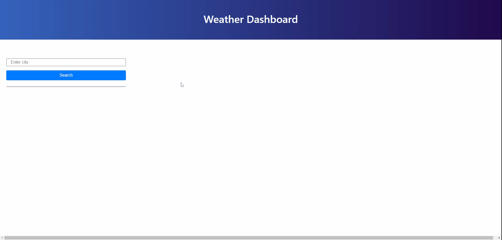
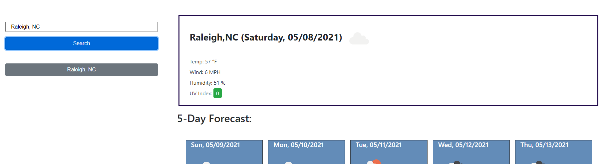
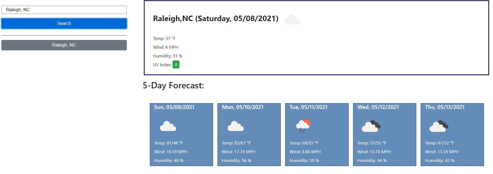

# Server-side APIs: Weather Dashboard

The purpose of this assignment is to apply what was learned how to apply server-side APIs. This application will allow you to search for the weather on any city in USA. 

You can review the weather dashboard application by going to the following url: https://santipalacios2002.github.io/weather-dashboard/

 

# Acceptance criteria
## :heavy_check_mark: City search

When the user search for a city, the user is presented with current and future conditions for that city and that city is added to the search history

 

## :heavy_check_mark: Weather presentation

For the current weather. the user is presented with the city name, the date, an icon representation of weather conditions, the temperature, the humidity, the wind speed, and the UV index

UV index is presented with a color that indicates whether the conditions are favorable, moderate, or severe

The user will also view future weather conditions for that city with a 5-day forecast that displays the date, an icon representation of weather conditions, the temperature, the wind speed, and the humidity
 

## :heavy_check_mark: Search history

Every search will be stored in the search history area and when the user cliks on a city in the search history, then the weather information is again presented with current and future conditions for that city

 

## :heavy_check_mark: Lessons learned

* Adding event listeners to dynamically generated elements was challenging. This will require further research in the future.

